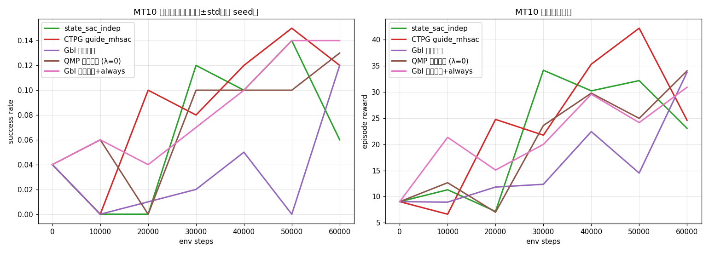

# GbI 对比实验验证报告

> 自动生成时间（UTC）：2026-09-03 22:03　分析脚本：scripts/alg/analyze_results.py

## 1. 数据概况

| 算法 | seeds | 末期成功率（均值±std，最后 3 个评估点） | 末期平均回报 |
|---|---|---|---|
| GbI 完整版 | — | PENDING | PENDING |
| QMP 消融 (λ≡0) | — | PENDING | PENDING |
| state_sac_indep | [0] | 0.100 ± 0.000 | 28.48 |
| CTPG guide_mhsac | [0] | 0.130 ± 0.000 | 34.02 |
| GbI 跨任务池 | [0] | 0.057 ± 0.000 | 23.56 |
| QMP 跨任务池 (λ≡0) | [0] | 0.110 ± 0.000 | 29.58 |
| GbI 跨任务池+always | [0] | 0.127 ± 0.000 | 28.20 |

## 2. 各任务独立成功率对照表（末期，均值跨 seed）

| 任务 | GbI 完整版 | QMP 消融 (λ≡0) | state_sac_indep | CTPG guide_mhsac | GbI 跨任务池 | QMP 跨任务池 (λ≡0) | GbI 跨任务池+always | GbI−QMP |
|---|---|---|---|---|---|---|---|---|
| task 0 | PENDING | PENDING | 0.233 | 0.233 | 0.100 | 0.033 | 0.267 | +0.067 |
| task 1 | PENDING | PENDING | 0.000 | 0.000 | 0.000 | 0.000 | 0.000 | +0.000 |
| task 2 | PENDING | PENDING | 0.000 | 0.000 | 0.000 | 0.000 | 0.000 | +0.000 |
| task 3 | PENDING | PENDING | 0.000 | 0.000 | 0.000 | 0.000 | 0.000 | +0.000 |
| task 4 | PENDING | PENDING | 0.000 | 0.033 | 0.000 | 0.000 | 0.000 | +0.000 |
| task 5 | PENDING | PENDING | 0.767 | 1.000 | 0.467 | 1.000 | 1.000 | -0.533 |
| task 6 | PENDING | PENDING | 0.000 | 0.000 | 0.000 | 0.000 | 0.000 | +0.000 |
| task 7 | PENDING | PENDING | 0.000 | 0.000 | 0.000 | 0.000 | 0.000 | +0.000 |
| task 8 | PENDING | PENDING | 0.000 | 0.000 | 0.000 | 0.067 | 0.000 | -0.067 |
| task 9 | PENDING | PENDING | 0.000 | 0.033 | 0.000 | 0.000 | 0.000 | +0.000 |

## 3. 关键对比（配对，按 seed 对齐）

### 3.1 GbI 跨任务池 vs QMP 跨任务池 (λ≡0)

- 对齐评估步：60000；配对 seeds：[0]
- 末期成功率：GbI 跨任务池 **0.120** vs QMP 跨任务池 (λ≡0) **0.130**，差 **-0.010**（跨 seed std=0.000，配对 t 检验 n/a）
- 学习曲线 AUC（成功率均值）：0.034 vs 0.076

### 3.2 GbI 跨任务池 vs state_sac_indep

- 对齐评估步：60000；配对 seeds：[0]
- 末期成功率：GbI 跨任务池 **0.120** vs state_sac_indep **0.060**，差 **+0.060**（跨 seed std=0.000，配对 t 检验 n/a）
- 学习曲线 AUC（成功率均值）：0.034 vs 0.066

### 3.3 GbI 跨任务池 vs CTPG guide_mhsac

- 对齐评估步：60000；配对 seeds：[0]
- 末期成功率：GbI 跨任务池 **0.120** vs CTPG guide_mhsac **0.120**，差 **-0.000**（跨 seed std=0.000，配对 t 检验 n/a）
- 学习曲线 AUC（成功率均值）：0.034 vs 0.087

### 3.4 GbI 完整版 vs QMP 消融 (λ≡0) —— PENDING（数据缺失）

### 3.5 GbI 完整版 vs state_sac_indep —— PENDING（数据缺失）

### 3.6 GbI 完整版 vs CTPG guide_mhsac —— PENDING（数据缺失）

## 4. 仲裁/世界模型指标分析（train.log）

### GbI 跨任务池

| 指标 | 全程均值 | 末期均值（后 20%） | 判定 |
|---|---|---|---|
| 触发率 | 0.0421 | 0.0457 | 正常 |
| 换手率 | 0.0064 | 0.0060 | 有换手 |
| U_score EMA | 0.0163 | 0.0356 |  |
| λ_t 信任权重 | 0.1462 | 0.3209 | 想象通道被信任 |
| Spearman κ_t | 0.1165 | 0.3209 |  |
| 触发阈值 τ_on | 0.0105 | 0.0189 |  |
| 拒绝阈值 τ_reject | 0.4300 | 0.8931 |  |
| 执行段平均长度 | 12.9589 | 12.9857 |  |
| 执行段累计数 | 1934.5142 | 3239.7515 |  |
| TTA 前损失 | 1.4577 | 1.7814 | — |
| TTA 后损失 | 1.4465 | 1.7681 |  |
| 世界模型总损失 | 1.3934 | 1.4156 |  |
| 奖励头损失 | 0.6191 | 0.6216 |  |
| 动力学 MAE | 0.0010 | 0.0010 | 动力学良好 |
| 奖励头排序保真度 Spearman | 0.9697 | 0.9789 | 排序保真度良好 |
| 奖励分箱 absmax | 4.0000 | 4.0000 | 分箱范围合理 |
| 分箱利用率 | 0.1613 | 0.2098 | 分辨率可接受 |
| 分箱扩容次数 | 0.0000 | 0.0000 |  |
| |gain| 中位数（决策场密度） | 0.0013 | 0.0023 | 决策场非退化 |
| 每行 max_j gain 中位数 | 0.0012 | 0.0014 | gap 未达标(≤0.1) |
| gain>0 占比 | 0.5118 | 0.4677 |  |
| Q 锚极差中位数 | 0.4287 | 0.2167 |  |

### QMP 跨任务池 (λ≡0)

| 指标 | 全程均值 | 末期均值（后 20%） | 判定 |
|---|---|---|---|
| 触发率 | 0.5663 | 0.6187 | 异常（触发过少/过多） |
| 换手率 | 0.3378 | 0.3535 | 有换手 |
| U_score EMA | 0.0000 | 0.0000 |  |
| λ_t 信任权重 | 0.0000 | 0.0000 | λ≈0（想象通道未被信任） |
| Spearman κ_t | 0.0000 | 0.0000 |  |
| 触发阈值 τ_on | 0.0000 | 0.0000 |  |
| 拒绝阈值 τ_reject | 0.0000 | 0.0000 |  |
| 执行段平均长度 | 1.9946 | 1.9950 |  |
| 执行段累计数 | 108337.3154 | 191181.0701 |  |
| TTA 前损失 | — | — | — |
| TTA 后损失 | — | — | — |
| 世界模型总损失 | 1.4021 | 1.3957 |  |
| 奖励头损失 | 0.6301 | 0.6272 |  |
| 动力学 MAE | 0.0011 | 0.0011 | 动力学良好 |
| 奖励头排序保真度 Spearman | 0.9680 | 0.9784 | 排序保真度良好 |
| 奖励分箱 absmax | 4.0000 | 4.0000 | 分箱范围合理 |
| 分箱利用率 | 0.1572 | 0.1897 | 分辨率可接受 |
| 分箱扩容次数 | 0.0000 | 0.0000 |  |
| |gain| 中位数（决策场密度） | 0.0000 | 0.0000 | 决策场空（候选间无真实差异） |
| 每行 max_j gain 中位数 | 0.0000 | 0.0000 | gap 未达标(≤0.1) |
| gain>0 占比 | 0.0000 | 0.0000 |  |
| Q 锚极差中位数 | 0.3937 | 0.1685 |  |

### GbI 跨任务池+always

| 指标 | 全程均值 | 末期均值（后 20%） | 判定 |
|---|---|---|---|
| 触发率 | 0.6006 | 0.6521 | 异常（触发过少/过多） |
| 换手率 | 0.3035 | 0.3201 | 有换手 |
| U_score EMA | 0.0347 | 0.0957 |  |
| λ_t 信任权重 | 0.0148 | 0.0050 | λ≈0（想象通道未被信任） |
| Spearman κ_t | -0.0738 | -0.0807 |  |
| 触发阈值 τ_on | 0.0432 | 0.1587 |  |
| 拒绝阈值 τ_reject | 0.7513 | 1.8008 |  |
| 执行段平均长度 | 1.9946 | 1.9951 |  |
| 执行段累计数 | 98318.3154 | 173116.9872 |  |
| TTA 前损失 | — | — | — |
| TTA 后损失 | — | — | — |
| 世界模型总损失 | 1.4224 | 1.4252 |  |
| 奖励头损失 | 0.6314 | 0.6293 |  |
| 动力学 MAE | 0.0010 | 0.0011 | 动力学良好 |
| 奖励头排序保真度 Spearman | 0.9653 | 0.9741 | 排序保真度良好 |
| 奖励分箱 absmax | 4.0000 | 4.0000 | 分箱范围合理 |
| 分箱利用率 | 0.1883 | 0.2159 | 分辨率可接受 |
| 分箱扩容次数 | 0.0000 | 0.0000 |  |
| |gain| 中位数（决策场密度） | 0.0016 | 0.0029 | 决策场非退化 |
| 每行 max_j gain 中位数 | 0.0013 | 0.0019 | gap 未达标(≤0.1) |
| gain>0 占比 | 0.5260 | 0.5109 |  |
| Q 锚极差中位数 | 0.3608 | 0.1798 |  |

## 5. 结论：GbI 是否有效？

- **裁决公式判定（gbi_cross vs qmp_cross）**：**想象增益项未发挥作用**：GbI 跨任务池 与 QMP 跨任务池 (λ≡0) 末期成功率差 -0.010 （≤0.05 判定阈值），裁决主要由 Q 锚主导，λ_t·(Î_j−Î_i) 贡献微弱。
- **多任务裁决 vs 独立训练**：GbI 跨任务池 末期成功率与 state_sac_indep 差 +0.060，共享多任务框架 + 裁决优于独立训练。

> 判据说明：末期成功率 = 最后 3 个评估点均值；配对比较按相同 seed 对齐、在共同最大评估步上做配对 t 检验（n=seeds 数，小样本时以效应量为主）；GbI vs indep 在同一训练步数（300k）上比较，注意 indep 额外训练到 500k 的信息仅供参考。

> 仲裁指标合理性参考：TGR（触发率）应处于 2%–50% 区间；SWR（换手率）>0 说明裁决确实在候选间切换；λ_t 由 Spearman κ_t 校准，末期 >0 表示想象增益与真实增益正相关；DMAE（动力学一步 MAE）<0.01 表示世界模型动力学可信。
